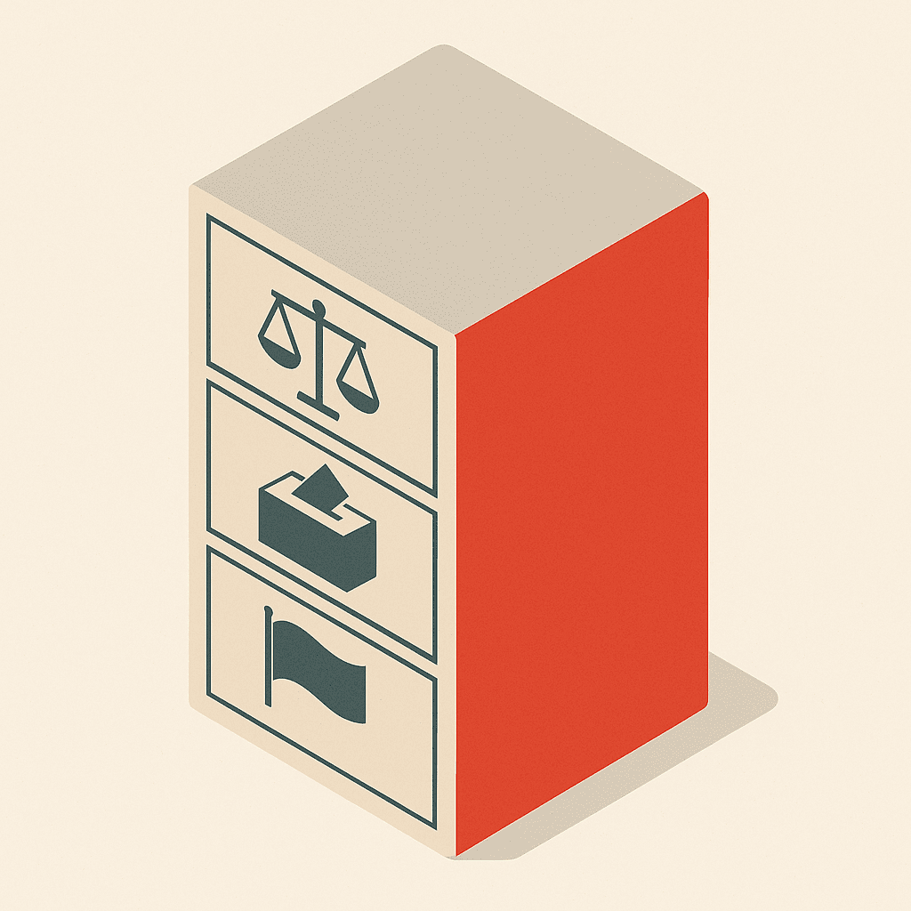
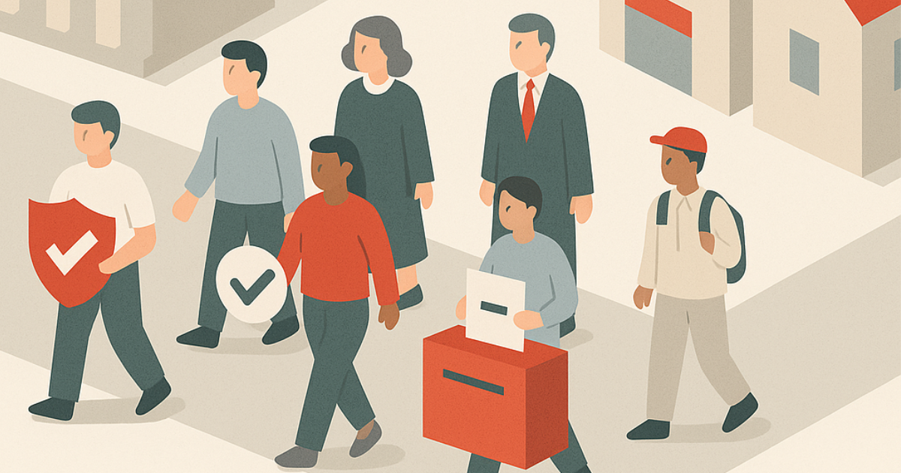

# What is the Constitution?

The Constitution is Malta’s super important instruction manual 🧭. It tells us how the country should work 🏛️, who runs it, and how people are protected. It makes sure no one has too much power ⚖️ and that all citizens are treated fairly.

## What’s inside?

- A list of **fundamental rights** ✅ (like being treated equally, freedom of religion 🙏, and the right to a fair trial ⚖️)
- Rules for **how leaders are chosen** 🗳️
- Information about Malta’s **national symbols** 🇲🇹
- Descriptions of how courts work 🧑‍⚖️ and what judges do

## What makes Malta special?

- Malta has its own **voting system** 🗳️ where people rank their favorite candidates
- Malta is a **neutral country** 🕊️ — we don’t join wars
- **Catholicism** is our official religion ✝️, but everyone can believe what they want

## Why it matters:

- It helps protect everyone’s rights ✋
- It makes sure leaders don’t break the rules 🚫
- It keeps the country fair, peaceful, and democratic 🕊️⚖️

---

> You can read the full constitution on the official legislation.mt website [here](https://legislation.mt/eli/const/eng).
