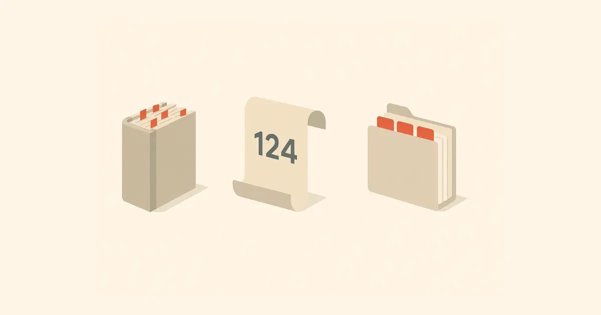
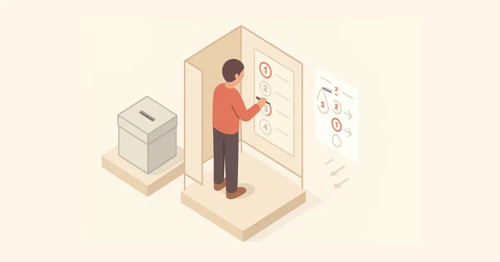

# What is the Constitution?

The Constitution is the **supreme law** of Malta 📜 — it’s like the foundation for how the country is governed 🏛️. It tells us who has power, how they should use it, and what rights all people have. It keeps everything balanced ⚖️ and fair.

## Structure and Key Parts:

- **12 Chapters** 📘, including one special one (Chapter XA) about local councils 🏘️
- **124 Articles** ✒️ covering rights, laws, and institutions
- **4 Schedules** 📄 with official oaths and lists

## What does it cover?

1. **National Identity** 🇲🇹  
   Malta is a **republic** and a **neutral country** 🕊️. It defines the national flag 🚩, anthem 🎶, and languages (Maltese and English 🗣️).

2. **Fundamental Rights** ✅

   - Right to life ❤️
   - Freedom of speech 🗣️
   - Freedom of religion 🙏
   - Protection from unfair arrest 🚫
   - Fair trial ⚖️

3. **Government Structure** 🏛️

   - **Parliament** makes laws 📜
   - **Prime Minister** leads the government 👨‍💼
   - **President** represents the state 👩‍⚖️
   - **Judiciary** ensures justice 🧑‍⚖️

4. **Voting & Representation** 🗳️  
   Uses the **Single Transferable Vote (STV)** so everyone’s vote counts fairly.

5. **Independent Judiciary** ⚖️  
   Judges can’t be removed easily. Courts make sure laws are fair and followed.

6. **Money & Oversight** 💰  
   **Auditor General** checks how public money is used. Parliament must approve spending.

7. **Local Councils** 🏘️  
   Towns and villages have councils that take care of local things like parks, bins, and events.

## How Malta Compares in the EU:

- ✅ Similar to others: Rights, democracy, fair courts
- 🌍 Unique: Official religion, neutrality, STV system
- 🇪🇺 Others have: Environmental rights 🌿, referendums 🗳️, stronger social rights 🏥🏠

## Why it matters:

- Protects freedom and justice ⚖️
- Limits power to avoid abuse ⛔
- Helps you understand your rights 🧠 and role as a citizen 🇲🇹
