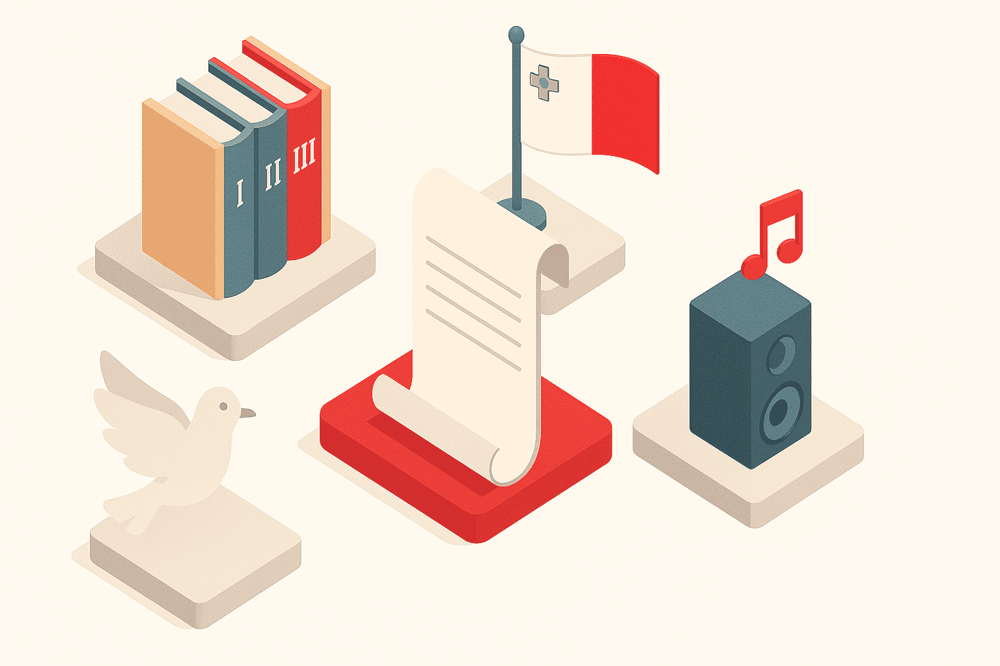
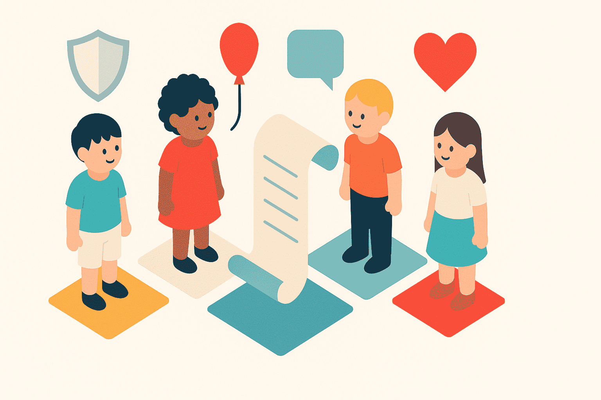

# What is the Constitution?

The Constitution is like the biggest rulebook 📖 Malta has! It tells everyone how to be fair, kind, and safe 😊. It helps the grown-ups who lead Malta (like the President 👩‍⚖️ and Prime Minister 👨‍💼) know what they can and can’t do. It also says what every person in Malta can do, like speaking freely 🗣️ or being treated nicely ❤️.

## Fun Facts:

- It has different chapters 📚, just like storybooks.
- It says what our flag 🚩 and national song 🎵 are.
- It says Malta is a peaceful 🕊️ place that doesn't join in fights.

## What does it protect?

- Your right to be safe 👶
- Your right to talk and play freely 🎈
- Your right to be treated kindly and fairly 💕

## Why it matters:

- It helps everyone play by the same rules 🎲
- It makes sure no one is being mean or unfair 😠
- It protects us, like a superhero shield 🦸 for everyone in Malta!
