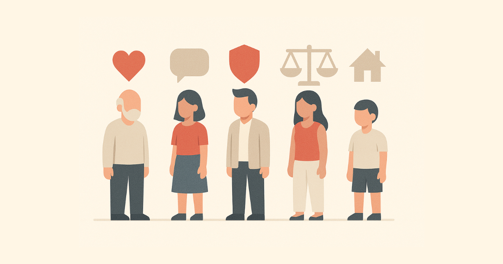
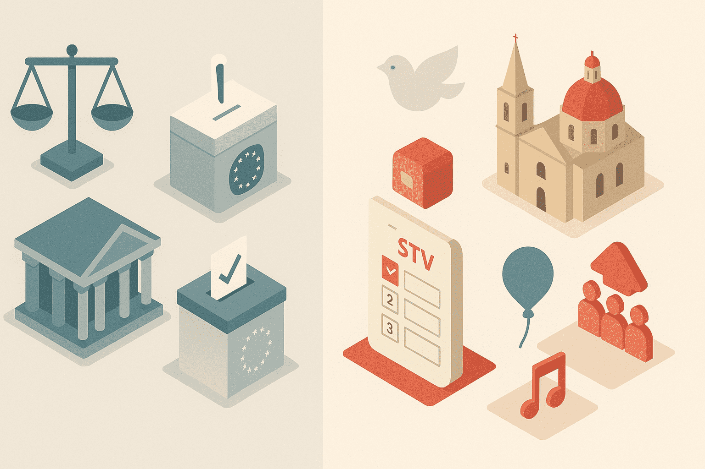
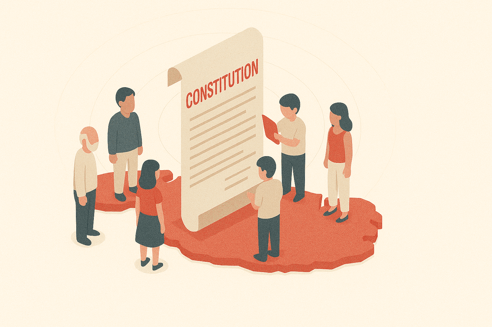

# What is the Constitution?

A constitution is a country’s most important legal document 📜. It sets out how the country is governed, what rights people have, and how different parts of the state—like Parliament, the Government, and the Courts—work together. Think of it as the “rulebook” that guides how power is used and protected in a democracy ⚖️.

Malta’s Constitution is the highest law of the land 🏛️. No other law can go against it, and if something does, the courts can strike it down.

---

## Basic Facts

- **Number of Chapters**: 12 (including Chapter XA)
- **Total Number of Articles**: 124 main articles
- **Schedules**: 4 (containing formal oaths and a list of Commonwealth countries)
- **First Adopted**: 1964 (when Malta became independent 🇲🇹)
- **Major Revision**: 1974 (when Malta became a republic 🗳️)
- **Last Amended**: 2025 (Judicial reform and Court structure ⚖️)

---

## What the Constitution Covers

### **The Republic and National Identity**

Malta is a **republic** and a **neutral state** 🕊️, meaning it does not align militarily with other countries or allow foreign bases on its soil. The Constitution declares **Catholicism as the official religion**, but also protects **freedom of religion**. It also defines Malta’s flag 🇲🇹, anthem 🎶, and official languages (Maltese and English).

### **Citizens’ Rights**

Malta’s Constitution includes a list of **fundamental rights**, such as:

- The right to life ❤️
- Freedom of speech and religion 🗣️🙏
- Protection from unfair arrest or discrimination 🚫
- The right to a fair trial ⚖️
- The right to own property 🏠

If any of these rights are violated, citizens can go to court to seek justice.

### **How Government Works**

The Constitution separates power into three branches:

- **Parliament** (makes the laws 📜)
- **Government** (runs the country, led by the Prime Minister 👨‍💼)
- **Judiciary** (interprets laws and ensures justice 👩‍⚖️)

There’s also a **President**, who is Malta’s head of state. The President mostly represents the country and signs laws, but doesn’t run the government.

### **Elections and Parliament**

Malta has **one Parliament**, elected every five years using a **unique voting system** called the **Single Transferable Vote (STV)** 🗳️. This lets voters rank candidates by preference and aims for fair representation.

### **Judges and Courts**

The Constitution guarantees **independent courts** ⚖️. Judges are protected from political pressure and can only be removed in serious cases. There is also a **Constitutional Court**, which settles issues about rights and the Constitution itself.

### **Local Government**

Chapter XA establishes **local councils**, like city and town councils 🏘️, that handle community matters.

### **Public Finance and Oversight**

The Constitution ensures that **public money** 💰 is handled responsibly. The **Auditor General** checks how government money is spent, and Parliament must approve all major spending.

---

## The Schedules

The Constitution includes 4 Schedules:

1. **Oaths of allegiance** (e.g. what the President or Prime Minister must swear ✋)
2. **More formal oaths of office**
3. **MPs’ oath of allegiance**
4. **List of Commonwealth countries** (used for citizenship laws 🌍)

---

## How It Compares to Other EU Constitutions

Malta’s Constitution shares a lot in common with those of other EU countries—but also has some unique features.

### Similarities:

- **Protects rights and freedoms**
- **Separates powers** between Parliament, Government, and Courts
- **Independent courts and elections**
- **Rule of law** and checks on power

### Unique to Malta:

- **Official religion** is Roman Catholicism ✝️ (rare in EU)
- **Neutrality clause** 🕊️ (only Austria has something similar)
- **Single Transferable Vote system** 🗳️ (only Malta and Ireland use it)
- **Top-up seats** in Parliament to fix imbalances
- **Declaration of Principles** in Chapter II (like social goals that guide policy)

### What Others Have That Malta Doesn’t:

- Some EU constitutions guarantee **environmental rights** 🌱 or **digital/data rights** 💻 directly
- A few countries (like Ireland) require a **public referendum** to change the constitution—Malta doesn’t
- Some have **stronger social rights** (e.g. housing, healthcare) that are enforceable in court 🏥🏘️

---

## Why It Matters

Understanding the Constitution helps citizens:

- Know their **rights**
- Know how their **government works**
- Recognize what’s **fair or unfair**
- Hold leaders **accountable** 🗳️

The Constitution isn’t just for lawyers—it’s for everyone. It’s the backbone of how Malta stays free, fair, and democratic 💪.
